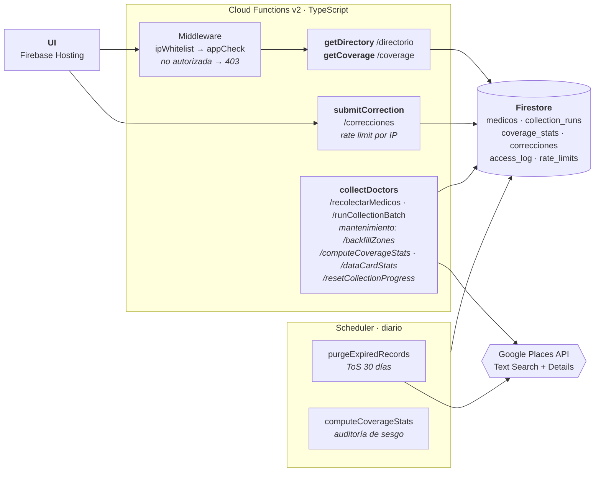

# Directorio de Médicos Especialistas — Documentación Técnica

**Cliente:** Ministerio de Educación de Guatemala · **Curso:** CC3106 Responsible AI, UVG
**Equipo:** 4 personas · **Alcance:** Ciudad de Guatemala, zonas 1–18
**Repositorio:** Functions + UI + pruebas + CI · **Fecha de esta versión:** ‹completar al entregar›

> Los marcadores `‹pendiente›` indican números que solo existen tras la recolección en
> producción. No se rellenan con estimaciones: inventar cifras en un documento sobre
> manejo responsable de datos contradiría el propio entregable.

---

## 1. Qué es este sistema

Un directorio de médicos especialistas construido sobre Google Places API, con API paginada
protegida por IP whitelist y UI de consulta.

El sistema no se limita a recolectar: **mide y publica sus propios sesgos** (§8), implementa los
límites de los Términos de Servicio de Google en código y no en prosa (§7), y expone un
mecanismo de corrección y remoción para las personas cuyos datos aparecen sin haberlo
consentido (§11). La IP whitelist se implementa como se pide, y se documenta por qué no
basta (§6).

---

## 2. Arquitectura



**Stack:** TypeScript · Firebase Functions v2 · Firestore · Google Places API · Firebase Hosting.
El 90 % del desarrollo corre contra el emulador de Firebase; producción se usa solo para las
pruebas finales y la demo, porque cada invocación desplegada tiene costo real.

### Cloud Functions

| Función | Ruta / disparador | Responsabilidad |
|---|---|---|
| `collectDoctors` | `GET /recolectarMedicos` | Búsqueda puntual: keyword + zona + especialidad → Places → Firestore. Tope **20 resultados** por invocación. |
| `collectDoctors` | `GET /runCollectionBatch` | Recorre la matriz de 576 keywords con cursor persistido, en lotes de 1–10. |
| `getDirectory` | `GET /directorio` | Paginado con filtros. Excluye `suppressed` y vencidos. |
| `getCoverage` | `GET /coverage` | Sirve `coverage_stats` precalculado para el heatmap. |
| `submitCorrection` | `POST /correcciones` | Corrección o remoción. **Sin IP whitelist** (debe ser público); rate limit por IP. |
| `purgeExpiredRecordsScheduled` | Diario | Refresca o purga documentos vencidos. Cumplimiento ToS. |
| `computeCoverageStatsScheduled` | Diario | Recalcula la matriz zona × especialidad. |

Cuatro rutas de mantenimiento más, bajo la misma IP whitelist y sin costo de Places API:
`/computeCoverageStats` (disparo manual del cálculo diario), `/dataCardStats` (agrega las cifras
que publica la Data Card, para no transcribirlas a mano), `/backfillZones` (recalcula `zona` sobre
documentos ya almacenados, operación de una sola vez) y `/resetCollectionProgress` (reinicia el
cursor; solo necesario tras cambiar el orden de la matriz).

---

## 3. Modelo de datos

`place_id` es la clave del documento en `medicos`: es el identificador estable de Google y
convierte la reinserción en un upsert idempotente, así que la deduplicación es una propiedad
del esquema, no un paso de limpieza.

```
medicos/{place_id}
  nombre, direccion, telefono|null, sitio_web|null, lat|null, lng|null
  especialidad              # efectiva — el campo por el que filtra /directorio
  especialidad_raw          # la especialidad con la que se buscó (trazabilidad)
  especialidad_normalizada  # derivada del nombre por reglas | null
  confidence                # 0.9 si hubo match, 0 si no
  zona                      # efectiva — el campo por el que filtra /directorio
  zona_raw                  # la zona con la que se buscó (trazabilidad)
  zona_normalizada          # extraída de la dirección por regex | null
  missing_fields: string[]  # ausencias explícitas, nunca cadenas vacías
  fecha_recoleccion, expires_at, run_id, keyword_usado
  suppressed: boolean       # true tras una solicitud de remoción
```

Especialidad y zona siguen deliberadamente **la misma forma de tres campos**: el buscado nunca se
sobrescribe, el derivado puede quedar `null`, y un tercero resuelve cuál gana. Places no expone
ninguno de los dos, así que ambos salen del único texto libre disponible — `nombre` y `direccion`.

Colecciones de apoyo: `collection_runs` (telemetría por corrida), `coverage_stats`
(matriz precalculada), `correcciones` (cola de revisión), `access_log` (200/403/429),
`rate_limits` (ventana fija de 60 s), `collection_progress/state` (cursor compartido).

### Normalización de especialidades

Google Places **no tiene un campo de especialidad médica**. Lo único disponible es el `nombre`
del negocio como texto libre. Ante eso se evaluaron dos opciones y se eligió la primera:

- **Reglas determinísticas (implementada).** Un diccionario de raíces por especialidad escanea
  el nombre sin distinguir acentos ni género/número. Si hay coincidencia, `especialidad_normalizada`
  se llena con confianza 0.9; si no, queda `null` con confianza 0. **Nunca se inventa una especialidad.**
- **LLM (descartada).** Exigiría un set de evaluación etiquetado a mano (≥100 registros) y
  presupuesto de inferencia no contemplado. El criterio de descarte no fue solo costo: una
  especialidad alucinada puede derivar en daño al paciente, y ese error pesa más que la
  cobertura adicional que un modelo aportaría.

`/directorio` filtra por `especialidad` = `especialidad_normalizada ?? especialidad_raw`: lo que
el lugar aparenta ser gana sobre lo que buscamos. Una "Clínica Pediátrica" encontrada con un
keyword de cardiología aparece bajo pediatría, no bajo cardiología. El fallback a la especialidad
buscada es deliberado — cuando el nombre no revela nada, esa es la única señal disponible, y
preferimos una señal débil pero declarada a esconder el registro de todo filtro.

### Normalización de zonas

La zona buscada tampoco es confiable por sí sola: **Text Search puede devolver lugares fuera de la
zona consultada**, e incluso fuera de Ciudad de Guatemala, porque hace match por nombre y tipo de
negocio, no por ubicación. Buscar "clínica pediátrica zona 5 Guatemala" puede devolver una clínica
en Escuintla, y guardarla bajo `zona 5` habría contaminado la matriz que la auditoría (§8) existe
para medir.

`zona_normalizada` se extrae de `direccion` por regex sobre el patrón `zona N`, con valores de 1 a
25. Si la dirección no la menciona, queda `null` y `zona` cae a `zona_raw`. Igual que con
especialidad, **no se asume**: el fallback está declarado, no disfrazado de dato verificado.

Nota metodológica: `coverage_stats` agrupa por `zona_raw`, no por la zona efectiva — el porqué
está en `docs/auditoria-cobertura.md` §3, decisión 4.

---

## 4. Recolección de datos

**Patrón de keyword:** `"<sufijo> <especialidad> <zona> Guatemala"`, con 4 sufijos
(`médico`, `doctor`, `clínica`, `consultorio`) porque Google Maps no tiene nomenclatura
consistente para consultorios médicos.

**Matriz:** 8 especialidades × 4 sufijos × 18 zonas = **576 combinaciones**.

**Orden de recorrido ancho-primero.** La matriz se recorre sufijo → zona → especialidad, no zona →
especialidad → sufijo. Con cuota diaria limitada la recolección toma varios días, y agotar una
zona antes de tocar las demás dejaría el heatmap parcial marcando casi todo como "nunca buscado"
cuando en realidad sí se buscó, solo que concentrado. Así, los primeros **144 combos** cubren cada
celda de la grilla una vez antes de repetir ninguna.

**Cobertura balanceada obligatoria.** Se ejecuta el mismo número de búsquedas en cada zona sin
importar cuántos resultados devuelva. Concentrar el esfuerzo donde "sí hay resultados"
contaminaría la auditoría de sesgo: mediríamos nuestro propio criterio de búsqueda en lugar de
la realidad de la fuente. Esta es la restricción metodológica central del proyecto.

Cada invocación consume 1 llamada de Text Search + hasta 20 de Place Details (teléfono y sitio
web no vienen en Text Search), y escribe un documento en `collection_runs` con keyword, zona,
resultados nuevos vs. duplicados y costo estimado. `runCollectionBatch` avanza un cursor
compartido en Firestore, de modo que cualquier integrante continúa donde otro se quedó sin
repetir búsquedas ni saltarse zonas.

---

## 5. API

`GET /directorio` — paginado, con filtros opcionales.

| Parámetro | Tipo | Default | Límite |
|---|---|---|---|
| `page` | entero ≥ 1 | 1 | — |
| `pageSize` | entero ≥ 1 | 20 | **50** (se recorta, no se rechaza) |
| `especialidad` | string | — | filtra por especialidad efectiva |
| `zona` | string | — | filtra por zona efectiva; se buscan `zona 1` … `zona 18` |

El filtro acepta zonas fuera del rango buscado: la zona efectiva sale de la dirección real (§3) y
puede llegar a `zona 25`. Esos registros no se recortan —son resultados legítimos de Places fuera
del alcance de búsqueda— pero la grilla de la auditoría sigue siendo la de las zonas 1–18.

Respuesta: `{ results, page, pageSize, hasMore }`. Entradas inválidas caen al default en vez de
devolver 400 — un `pageSize=abc` no debe romper la UI.

Los filtros de `suppressed` y `expires_at` se aplican **en memoria**, no en la consulta de
Firestore, para no exigir un índice compuesto por cada combinación de filtros. Como eso podría
dejar una página a medio llenar, la consulta sobre-lee con duplicación progresiva del límite
(hasta 5 rondas) antes de recurrir a leer todo.

---

## 6. Seguridad y modelo de amenazas

La IP whitelist se implementa como middleware, primer paso de la request: si la IP no está
autorizada devuelve **403 sin ejecutar ninguna lógica adicional**. Toda decisión (200/403/429)
queda en `access_log`.

La IP se deriva del proxy de confianza de Cloud Functions. **No se confía en `X-Forwarded-For`
crudo**, que el cliente puede falsificar; hay un test automatizado que envía el header falso y
exige 403.

**Por qué la whitelist no basta:**

| Debilidad | Impacto | Mitigación aplicada |
|---|---|---|
| `X-Forwarded-For` falsificable si se lee mal | Bypass total | IP del proxy de confianza + test de spoofing |
| Es ubicación de red, no autenticación | Cualquiera dentro de la IP entra | Rate limit por IP + auditoría |
| IPs dinámicas / red móvil | Falsos negativos, acceso roto | Limitación operativa documentada |
| No frena abuso desde IP autorizada | Extracción masiva del dataset | Rate limit + tope de 50 por página |

**Defensa en profundidad:** Firebase App Check en la UI, rate limit por IP en `/correcciones`,
`access_log` auditable, y API key restringida por IP en la consola de GCP. La key vive en
variables de entorno y nunca en el código fuente.

**Cierre del hueco de configuración.** Que `APP_CHECK_ENFORCE` existiera en el código no
garantizaba nada: si nadie la ponía en `true` al desplegar, quedaba inerte sin más señal que un
log que nadie revisa. `firebase.json` corre ahora un script de predeploy que **aborta el deploy**
si el proyecto destino no es de emulador y falta `APP_CHECK_ENFORCE=true`. Declarar la variable
dejó de ser suficiente; el pipeline lo hace cumplir.

---

## 7. Cumplimiento de los Términos de Servicio

Los ToS de Google Maps Platform permiten almacenar `place_id` indefinidamente, pero el resto del
contenido de Places solo puede cachearse de forma temporal, con un máximo de **30 días
calendario consecutivos**. Un proyecto que guarda nombres y teléfonos "para siempre porque es
académico" está en incumplimiento.

Cada documento lleva `expires_at = fecha_recoleccion + 30 días`, y la purga diaria hace:

- **Refresco:** re-consulta por `place_id`, reemplaza el contenido y renueva la ventana.
- **Purga:** elimina el contenido y conserva `place_id` más un `purge_reason` — `suppressed`,
  `no_api_key`, `not_found_in_places` o `refresh_error`. La distinción importa: "Google confirmó
  que cerró" y "no teníamos la key configurada" producirían documentos idénticos si no se
  registrara el motivo, y el segundo caso es un problema de configuración disfrazado de dato.

Un registro `suppressed` **nunca se refresca**, se purga directo: refrescar a alguien que pidió
su remoción desharía la remoción. La purga borra también los campos derivados —`especialidad`,
`especialidad_normalizada`, `confidence`, `zona_raw` y `zona_normalizada`—: haberlos calculado
nosotros no los saca del alcance de los ToS si su insumo vino de Places.

---

## 8. Auditoría de cobertura y sesgo

Con los mismos datos ya recolectados (costo de API adicional ≈ 0) se calcula por celda
zona × especialidad: búsquedas ejecutadas, resultados únicos, % con teléfono y % con sitio web.

Recolección en producción del 12 de agosto de 2026: **122 de 144 celdas** con al menos un
resultado, **22 buscadas sin devolver ninguno**, y sobre las celdas con datos **87.16 % con
teléfono** frente a **43.27 % con sitio web** — la brecha entre ambos ya es un indicador de
digitalización parcial. El heatmap alterna entre ambas métricas, porque una celda puede ser densa
en resultados y pobre en contacto a la vez.

El detalle metodológico, los datos y el hallazgo están en **`docs/auditoria-cobertura.md`**.
Una decisión de método merece mención aquí: `searches_run` se cuenta desde `collection_runs`,
no desde `medicos`. Si se contara desde los resultados, una zona buscada diez veces sin
encontrar nada y una zona nunca buscada se verían idénticas —cero registros— y esa
distinción es justamente lo que la auditoría existe para capturar.

---

## 9. Costos

Text Search (~$0.032) y Place Details (~$0.017) tienen tarifas distintas; sumarlas a una sola
subestimaba el gasto, así que `collection_runs` las contabiliza por separado.

| Métrica | Valor |
|---|---|
| Corridas / llamadas a la API | 349 · 5,821 |
| Gasto teórico a tarifa de lista | **$104.19 USD** |
| Cargo real facturado | **$0.00 USD** |
| Registros únicos | 768 |
| **Costo teórico por médico único** | **≈ $0.136 USD** |
| Tasa de duplicados | ‹pendiente — ver `results_duplicated` en `collection_runs`› |

**Corrección sobre el crédito de $200.** El enunciado del proyecto asume un crédito mensual fijo
de $200 en Places API. **Ese crédito se descontinuó el 1 de marzo de 2025**, reemplazado por 10,000
llamadas gratis al mes por producto en el nivel Essentials. Las 5,821 llamadas caen completas en
esa cuota, así que el cargo real fue **$0.00** — verificado en la consola de facturación de GCP y
contra la documentación oficial, no asumido. Los $104.19 se reportan igual porque miden disciplina
de gasto por llamada: bajo el esquema actual, un equipo que midió su consumo y uno que no llegan
al mismo $0.00, y solo uno sabría qué pasa al cruzar las 10,000 llamadas.

Controles preventivos: alertas de billing al 50 % y 90 % del **presupuesto configurado** —un budget
propio, no el crédito de la API—, cuota máxima diaria de llamadas, y desarrollo en emulador. Cada
integrante usa su propio proyecto GCP y responde por su propio gasto.

---

## 10. Pruebas y CI

39 pruebas de integración corren contra el emulador de Firebase en GitHub Actions, con costo de
API cero. Cubren: IP no autorizada → 403; `X-Forwarded-For` falsificado → 403; tope de
`pageSize`; documento vencido ausente de `/directorio`; la purga conserva `place_id` y elimina
contenido; un registro `suppressed` no reaparece tras re-recolección; reinserción del mismo
`place_id` no duplica; extracción de zona con y sin patrón reconocible; cursor de recolección; y
un recorrido end-to-end de la recolección a la remoción.

Correr la suite completa contra producción consumiría cuota real, así que ese paso es un
checklist manual previo a la demo, documentado en el README.

---

## 11. Postura ética

- **ToS:** la ventana de 30 días está implementada en código, no declarada en prosa.
- **No fabricación:** no se agregan ni infieren datos ausentes. Los campos faltantes se guardan
  como `null` con `missing_fields`, y la UI muestra "No reportado en la fuente" — nunca un
  espacio en blanco que parezca dato. El campo `sitio_web` puede estar vacío o apuntar a una
  clínica en lugar de a un sitio propio; se documenta como viene.
- **Sesgo de fuente:** publicamos la auditoría de cobertura y su hallazgo, incluso cuando el
  hallazgo debilita la utilidad aparente del producto.
- **Uso previsto y prohibido:** el directorio es referencia informativa, **no validación de
  credenciales médicas**. Se declara en la UI y en la Data Card.
- **Frescura:** `fecha_recoleccion` acompaña todo dato mostrado o exportado, con su antigüedad
  en días.
- **Derechos de terceros:** los médicos listados no consintieron aparecer aquí; que su
  información sea pública en Google Maps no equivale a consentimiento para redistribuirla. El
  mecanismo de corrección y remoción es operativo y visible en la UI, no escondido en un pie
  de página. Una remoción sobrevive a recolecciones futuras.
- **Alcance:** los datos no se redistribuyen como producto independiente. El alcance es
  estrictamente académico; en producción real haría falta un acuerdo comercial con Google.

---

## 12. Limitaciones conocidas

La limitación central es que **la cobertura refleja presencia digital en Google Maps, no oferta
médica**: una celda vacía significa "Google no lo tiene", nunca "ahí no hay médicos". Le siguen
que especialidad y zona son inferidas o asumidas pero nunca verificadas, que Text Search puede
devolver lugares fuera del alcance geográfico consultado, que la whitelist protege ubicación de
red y no identidad, y que el dato puede tener hasta 30 días de antigüedad. El
inventario completo está en `docs/data-card.md` §5 y el detalle del sesgo en
`docs/auditoria-cobertura.md`.
